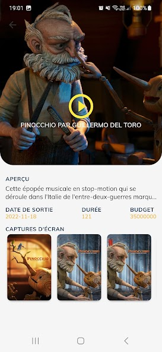

# 🔥🔥 Build and Deploy: Flutter application 🔥🔥
This is a repository for a Flutter application.
<h1 align="center">
  SAWADOGO Badini Ibrahim
</h1>

# Download the app
https://play.google.com/store/apps/details?id=com.badiniibrahim.db_movie&hl=fr

# Screenshot for You 💖

